# 教程

> 作者：蒋金楠 
> 微信公众账号：大内老A
> 微博：[www.weibo.com/artech](http://www.weibo.com/artech)
> 如果你想及时得到个人撰写文章以及著作的消息推送，或者想看看个人推荐的技术资料，可以扫描左边二维码（或者长按识别二维码）关注个人公众号）。
> 本文版权归作者和博客园共有，欢迎转载，但未经作者同意必须保留此段声明，且在文章页面明显位置给出原文连接，否则保留追究法律责任的权利。 
>
> 200行代码，7个对象——让你了解ASP.NET Core框架的本质 - Artech - 博客园
> https://www.cnblogs.com/artech/p/inside-asp-net-core-framework.html

[TOC]

## 教程地址

200行代码，7个对象——让你了解ASP.NET Core框架的本质 - Artech - 博客园
https://www.cnblogs.com/artech/p/inside-asp-net-core-framework.html


此项目是迷你版的ASP.NET Core框架，我在代码分布模拟 .net core 框架的代码分布，而对教程里面的代码位置有调整


## ASP.NET Core Mini要求

- 简单
- 真实模拟
- 可执行

## 教程文档备份和记录

### 1. 从Hello World谈起

当我们最开始学习一门技术的时候都喜欢从Hello World来时，貌似和我们本篇的主题不太搭。但事实却非如此，在我们看来如下这个Hello World是对ASP.NET Core框架本质最好的体现。 

```c#
public class Program
{
    public static void Main()
    => new WebHostBuilder()
        .UseKestrel()
        .Configure(app => app.Run(context => context.Response.WriteAsync("Hello World!")))
        .Build()
        .Run();
}
```

如上这个Hello World程序虽然人为地划分为若干行，但是整个应用程序其实只有一个语句。这个语句涉及到了ASP.NET Core程序两个核心对象`WebHost`和`WebHostBuilder`。我们可以将WebHost理解为寄宿或者承载Web应用的宿主，应用的启动可以通过启动作为宿主的WebHost来实现。至于WebHostBuilder，顾名思义，就是WebHost的构建者。

在调用WebHostBuilder的Build方法创建出WebHost之前，我们调用了它的两个方法，其中UseKestrel旨在注册一个名为Kestrel的服务器，而Configure方法的调用则是为了注册一个用来处理请求的中间件，后者在响应的主体内容中写入一个“Hello World”文本。

当我们调用Run方法启动作为应用宿主的WebHost的时候，后者会利用WebHostBuilder提供的服务器和中间件构建一个请求处理管道。这个由一个服务器和若干中间件构成的管道就是ASP.NET Core框架的核心，我们接下来的核心任务就是让大家搞清楚这个管道是如何被构建起来的，以及该管道采用怎样的请求处理流程。

 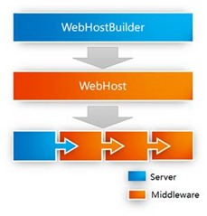

### 2. ASP.NET Core Mini

在过去这些年中，我不断地被问到同一个问题：如何深入地去一个开发框架。我知道每个人都具有适合自己的学习方式，而且我觉得我个人的学习方法也算不上高效，所以我很少会正面回应这个问题。不过有一个方法我倒很乐意与大家分享，那就是当你在学习一个开发框架的时候不要只关注编程层面的东西，而应该将更多的精力集中到对架构设计层面的学习。

针对某个框架来说，它提供的编程模式纷繁复杂，而底层的设计原理倒显得简单明了。那么如何检验我们对框架的设计原理是否透彻呢，我觉得最好的方式就是根据你的理解对框架进行“再造”。当你按照你的方式对框架进行“重建”的过程中，你会发现很多遗漏的东西。如果被你重建的框架能够支撑一个可以运行的Hello World应用，那么可以基本上证明你已经基本理解了这个框架最本质的东西。

虽然ASP.NET Core目前是一个开源的项目，我们可以完全通过源码来学习它，但是我相信这对于绝大部分人来说是有难度的。为此我们将ASP.NET Core最本质、最核心的部分提取出来，重新构建了一个迷你版的ASP.NET Core框架。 

 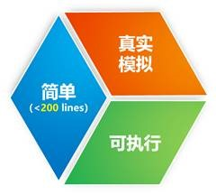

 ASP.NET Core Mini具有如上所示的三大特点。

第一、它是对真实ASP.NET Core框架的真实模拟，所以在部分API的定义上我们做了最大限度的简化，但是两者的本质是完全一致的。如果你能理解ASP.NET Core Mini，意味着你也就是理解了真实ASP.NET Core框架。

第二、这个框架是可执行的，我们提供的并不是伪代码。

第三、为了让大家能够在最短的时间内理解ASP.NET Core框架的精髓，ASP.NET Core Mini必需足够简单，所以我们整个实现的核心代码不会超过200行。  

### 3. Hello World 2

既然我们的ASP.NET Core Mini是可执行的，意味着我们可以在上面构建我们自己的应用，如下所示的就是在ASP.NET Core Mini上面开发的Hello World，可以看出它采用了与真实ASP.NET Core框架一致的编程模式。

```c#
public class Program
{
    public static async Task Main()
    {
        await new WebHostBuilder()
            .UseHttpListener()
            .Configure(app => app
                .Use(FooMiddleware)
                .Use(BarMiddleware)
                .Use(BazMiddleware))
            .Build()
            .StartAsync();
    }

    public static RequestDelegate FooMiddleware(RequestDelegate next)
    => async context => {
        await context.Response.WriteAsync("Foo=>");
        await next(context);
    };

    public static RequestDelegate BarMiddleware(RequestDelegate next)
    => async context => {
            await context.Response.WriteAsync("Bar=>");

            await next(context);
        };

    public static RequestDelegate BazMiddleware(RequestDelegate next)
    => context => context.Response.WriteAsync("Baz");
}
```

我们有必要对上面这个Hello World程序作一个简答的介绍：在创建出WebHostBuilder之后，我们调用了它的扩展方法`UseHttpListener`注册了一个自定义的基于`HttpListener`的服务器，我们会在后续内容中介绍该服务器的实现。在随后针对`Configure`方法的调用中，我们注册了三个中间件。由于中间件最终是通过Delegate对象来体现的，所以我们可以将中间件定义成与Delegate类型具有相同签名的方法。

我们目前可以先不用考虑表示中间件的三个方法为什么需要成如上的形式，只需要知道三个中间件在针对请求的处理流程中都作了些什么。上面的代码很清楚，三个中间件分别会在响应的内容中写入一段文字，所以程序运行后，如果我们利用浏览器访问该应用，会得到如下所示的输出结果。

  

### 4. 第一个对象：HttpContext

正如本篇文章表示所说，我们的ASP.NET Core Mini由7个核心对象构建而成。第一个就是大家非常熟悉的`HttpContext`对象，它可以说是ASP.NET Core应用开发中使用频率最高的对象。要说明`HttpContext`的本质，还得从请求处理管道的层面来讲。

对于由一个服务器和多个中间件构建的管道来说，面向传输层的服务器负责请求的监听、接收和最终的响应，当它接收到客户端发送的请求后，需要将它分发给后续中间件进行处理。对于某个中间件来说，当我们完成了自身的请求处理任务之后，在大部分情况下也需要将请求分发给后续的中间件。请求在服务器与中间件之间，以及在中间件之间的分发是通过共享上下文的方式实现的。

 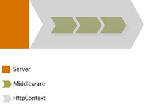 

如上图所示，当服务器接收到请求之后，会创建一个通过HttpContext表示的上下文对象，所有中间件都是在这个上下文中处理请求的，那么一个HttpContext对象究竟携带怎样的上下文信息呢？我们知道一个HTTP事务（Transaction）具有非常清晰的界定，即接收请求、发送响应，所以请求和响应是两个基本的要素，也是HttpContext承载的最核心的上下文信息。

我们可以将**请求理解为输入、响应理解为输出**，所以应用程序可以利用`HttpContext`得到当前请求所有的输入信息，也可以利用它完成我们所需的所有输出工作。为此我们为ASP.NET Core Mini定义了如下这个极简版本的HttpContext。

```c#
//IceDog.NetCoreMini\IceDog.NetCoreMini.Core\Http\HttpContext.cs
using IceDog.NetCoreMini.Core.Http.Features;

namespace IceDog.NetCoreMini.Core.Http
{
    /// <summary>
    /// http 上下文
    /// </summary>
    public class HttpContext
    {
        /// <summary>
        /// 构造函数
        /// </summary>
        /// <param name="features"></param>
        public HttpContext(IFeatureCollection features)
        {
            Request = new HttpRequest(features);
            Response = new HttpResponse(features);
        }

        /// <summary>
        /// 请求对象
        /// </summary>
        public HttpRequest Request { get; }
        /// <summary>
        /// 响应对象
        /// </summary>
        public HttpResponse Response { get; }
        
    }
}
```

```c#
//IceDog.NetCoreMini\IceDog.NetCoreMini.Core\Http\HttpRequest.cs
using IceDog.NetCoreMini.Core.Http.Features;
using System;
using System.Collections.Specialized;
using System.IO;

namespace IceDog.NetCoreMini.Core.Http
{
    /// <summary>
    /// http 请求
    /// </summary>
    public class HttpRequest
    {
        /// <summary>
        /// 自定义构造函数
        /// </summary>
        /// <param name="features"></param>
        public HttpRequest(IFeatureCollection features) => _feature = features.Get<IHttpRequestFeature>();

        /// <summary>
        /// http请求特性
        /// </summary>
        private readonly IHttpRequestFeature _feature;
        /// <summary>
        /// 请求的url
        /// </summary>
        public Uri Url => _feature.Url;
        /// <summary>
        /// 请求头
        /// </summary>
        public NameValueCollection Headers => _feature.Headers;
        /// <summary>
        /// 请求体
        /// </summary>
        public Stream Body => _feature.Body;
    }
}
```

```c#
//IceDog.NetCoreMini\IceDog.NetCoreMini.Core\Http\HttpResponse.cs
using IceDog.NetCoreMini.Core.Http.Features;
using System.Collections.Specialized;
using System.IO;

namespace IceDog.NetCoreMini.Core.Http
{
    /// <summary>
    /// http 响应
    /// </summary>
    public class HttpResponse
    {
        /// <summary>
        /// 自定义构造函数
        /// </summary>
        /// <param name="features"></param>
        public HttpResponse(IFeatureCollection features) => _feature = features.Get<IHttpResponseFeature>();
        /// <summary>
        /// http响应特性
        /// </summary>
        private readonly IHttpResponseFeature _feature;
        /// <summary>
        /// 响应头
        /// </summary>
        public NameValueCollection Headers => _feature.Headers;
        /// <summary>
        /// 响应流
        /// </summary>
        public Stream Body => _feature.Body;
        /// <summary>
        /// 响应状态码
        /// </summary>
        public int StatusCode { get => _feature.StatusCode; set => _feature.StatusCode = value; }
    }
}

```

如上面的代码片段所示，`HttpContext`通过它的两个属性`Request`和`Response`来表示请求和响应，它们对应的类型分别为`HttpRequest`和`HttpResponse`。通过前者，我们可以得到请求的地址、手部集合和主体内容，利用后者，我们可以设置响应状态码，也可以设置首部和主体内容。

### 5. 第二个对象：RequestDelegate

RequestDelegate是我们介绍的第二个核心对象。我们从命名可以看出这是一个委托（Delegate）对象，和上面介绍的HttpContext一样，我们也只有从管道的角度才能充分理解这个委托对象的本质。

在从事软件行业10多年来，我对软件的架构设计越来越具有这样的认识：好的设计一定是“简单”的设计。所以每当我在设计某个开发框架的时候，一直会不断告诉我自己：“还能再简单点吗？”。我们上面介绍的ASP.NET Core管道的设计就具有“简单”的特质：`Pipeline = Server + Middlewares`。但是“还能再简单点吗？”，其实是可以的：我们可以将**多个Middleware构建成一个单一的“HttpHandler”**，那么整个ASP.NET Core框架将具有更加简单的表达：`Pipeline =Server + HttpHandle`r。

 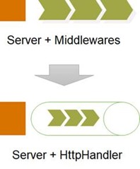 

那么我们如来表达`HttpHandler`呢？我们可以这样想：既然针对当前请求的所有输入和输出都通过HttpContext来表示，那么`HttpHandler`就可以表示成一个`Action<HttpContext>`对象。那么`HttpHandler`在ASP.NET Core中是通过`Action<HttpContext>`来表示的吗？其实不是的，原因很简单：`Action<HttpContext>`只能表示针对请求的 “同步” 处理操作，但是针对HTTP请求既可以是同步的，也可以是异步的，**更多地其实是异步的**。

那么在.NET Core的世界中如何来表示一个同步或者异步操作呢？你应该想得到，那就是**Task对象**，那么`HttpHandler`自然就可以表示为一个`Func<HttpContext，Task>`对象。由于这个委托对象实在太重要了，所以我们将它定义成一个独立的类型。

 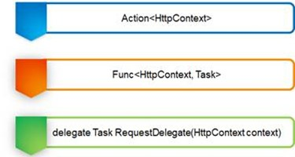

```c#
//IceDog.NetCoreMini\IceDog.NetCoreMini.Core\Http\RequestDelegate.cs
//Action<HttpContext>
//Func<HttpContext,Task>
using System.Threading.Tasks;

namespace IceDog.NetCoreMini.Core.Http
{
    /// <summary>
    /// 能处理 http请求的函数
    /// </summary>
    /// <param name="context">http 上下文</param>
    /// <returns></returns>
    /// <remarks>Equal to Func<HttpContext,Task></remarks>
    public delegate Task RequestDelegate(HttpContext context);
}

```

### 6. 第三个对象：Middleware

在对`RequestDelegate`这个委托对象具有充分认识之后，我们来聊聊中间件又如何表达，这也是我们介绍的第三个核心对象。中间件在ASP.NET Core被表示成一个`Func<RequestDelegate, RequestDelegate>`对象，也就是说它的输入和输出都是一个RequestDelegate。

 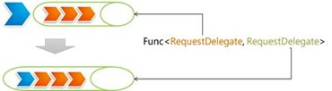

 

对于为什么会采用一个`Func<RequestDelegate, RequestDelegate>`对象来表示中间件，很多初学者会很难理解。我们可以这样的考虑：

对于管道的中的某一个中间件来说，由后续中间件组成的管道体现为一个`RequestDelegate`对象，由于当前中间件在完成了自身的请求处理任务之后，往往需要将请求分发给后续中间件进行处理，所以它需要将由后续中间件构成的`RequestDelegate`作为输入。

当代表中间件的委托对象执行之后，我们希望的是将当前中间件“纳入”这个管道，那么新的管道体现的`RequestDelegate`自然成为了输出结果。所以中间件自然就表示成输入和输出均为`RequestDelegate`的`Func<RequestDelegate, RequestDelegate>`对象。

```c#
//IceDog.NetCoreMini\IceDog.NetCoreMini.Core\Http\MiddlewareDelegate.cs
namespace IceDog.NetCoreMini.Core.Http
{
    /// <summary>
    /// 中间件委托
    /// </summary>
    /// <param name="requestDelegate"><请求委托/param>
    /// <returns>请求委托</returns>
    /// <remarks>Equal to Func<RequestDelegate,RequestDelegate></remarks>
    public delegate RequestDelegate MiddlewareDelegate(RequestDelegate requestDelegate);
}

//实际上使用的是如下Func委托即可
Func<RequestDelegate, RequestDelegate> middleware
```

### 7. 第四个对象：ApplicationBuilder

`ApplicationBuilder`是我们认识的第四个核心对象。从命名来看，这是我们接触到的第二个Builder，既然它被命名为`ApplicationBuilder`，意味着由它构建的就是一个`Application`。那么在ASP.NET Core框架的语义下应用（Application）又具有怎样的表达呢？

对于这个问题，我们可以这样来理解：既然`Pipeline = Server + HttpHandler`，那么用来处理请求的`HttpHandler`不就承载了当前应用的所有职责吗？那么`HttpHandler`就等于`Application`，由于HttpHandler通过`RequestDelegate`表示，那么由`ApplicationBuilder`构建的`Application`就是一个`RequestDelegate`对象。

  

由于表示`HttpHandler`的`RequestDelegate`是由注册的中间件来构建的，所以`ApplicationBuilder`还具有注册中间件的功能。基于ApplicationBuilder具有的这两个基本职责，我们可以将对应的接口定义成如下的形式。`Use`方法用来注册提供的中间件，Build方法则将注册的中间件构建成一个`RequestDelegate`对象。

```c#
//IceDog.NetCoreMini\IceDog.NetCoreMini.Core\Builder\IApplicationBuilder.cs
namespace IceDog.NetCoreMini.Core.Builder
{
    /// <summary>
    /// 通过定义一些机制来配置Application的请求管道
    /// </summary>
    public interface IApplicationBuilder
    {
        /// <summary>
        /// 添加需要的中间件
        /// </summary>
        /// <param name="middleware"></param>
        /// <returns></returns>
        IApplicationBuilder Use(Func<RequestDelegate, RequestDelegate> middleware);
        /// <summary>
        /// 构建一个程序用于处理http 请求
        /// </summary>
        /// <returns></returns>
        RequestDelegate Build();
    }
}
```

如下所示的是针对该接口的具体实现。我们利用一个列表来保存注册的中间件，所以Use方法只需要将提供的中间件添加到这个列表中即可。当`Build`方法被调用之后，我们只需**按照与注册相反的顺序依次执行**表示中间件的`Func<RequestDelegate, RequestDelegate>`对象就能最终构建出代表`HttpHandler`的`RequestDelegate`对象。

```c#
//IceDog.NetCoreMini\IceDog.NetCoreMini.Core\Builder\ApplicationBuilder.cs
namespace IceDog.NetCoreMini.Core.Builder
{
    /// <summary>
    /// 应用构建器
    /// </summary>
    class ApplicationBuilder : IApplicationBuilder
    {
        /// <summary>
        /// 中间件列表
        /// </summary>
        private readonly List<Func<RequestDelegate, RequestDelegate>> _middlewares = new List<Func<RequestDelegate, RequestDelegate>>();

        /// <summary>
        /// 
        /// </summary>
        /// <returns></returns>
        public RequestDelegate Build()
        {
            //反转中间件列表的顺序
            _middlewares.Reverse();

            return httpContext =>
            {
                //在调用第一个中间件（最后注册）的时候，我们创建了一个RequestDelegate作为输入
                //，后者会将响应状态码设置为404。所以如果ASP.NET Core应用在没有注册任何中间
                //的情况下总是会返回一个404的响应。如果所有的中间件在完成了自身的请求处理
                //任务之后都选择将请求向后分发，同样会返回一个404响应。
                RequestDelegate next = _ =>
                {
                    _.Response.StatusCode = 404;
                    return Task.CompletedTask;
                };

                foreach (var middleware in _middlewares)
                {
                    next = middleware(next);
                }
                return next(httpContext);
            };
        }
        /// <summary>
        /// 添加需要的中间件
        /// </summary>
        /// <param name="middleware">中间件</param>
        /// <returns></returns>
        public IApplicationBuilder Use(Func<RequestDelegate, RequestDelegate> middleware)
        {
            _middlewares.Add(middleware);
            return this;
        }
    }
}
```

在调用第一个中间件（最后注册）的时候，我们创建了一个`RequestDelegate`作为输入，后者会**将响应状态码设置为`404`**。所以如果ASP.NET Core应用在没有注册任何中间的情况下总是会返回一个404的响应。所有的中间件在完成了自身的请求处理任务之后都选择将请求向后分发，同样会返回一个404响应。

### 8. 第五个对象：Server

服务器在管道中的职责非常明确，当我们自动作应用宿主的WebHost的时候，服务它被自动启动。启动后的服务器会绑定到指定的端口进行请求监听，一旦有请求抵达，服务器会根据该请求创建出代表上下文的 `HttpContext `对象，并将该上下文作为输入调用由所有注册中间件构建而成的`RequestDelegate`对象。

 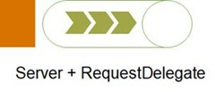 

简单起见，我们使用如下这个简写的IServer接口来表示服务器。我们通过定义在IServer接口的唯一方法StartAsync启动服务器，作为参数的handler正是由所有注册中间件共同构建而成的RequestDelegate对象

```c#
//IceDog.NetCoreMini\IceDog.NetCoreMini.Core\Hosting\Server\IServer.cs
using IceDog.NetCoreMini.Core.Http;
using System.Threading.Tasks;

namespace IceDog.NetCoreMini.Core.Hosting.Server
{
    /// <summary>
    /// server类
    /// </summary>
    public interface IServer
    {
        /// <summary>
        /// 异步启动任务
        /// </summary>
        /// <param name="handler">http处理程序</param>
        /// <returns></returns>
        Task StartAsync(RequestDelegate handler);
    }
}

```

### 9. HttpContext和Server之间的适配

面向应用层的HttpContext对象是对请求和响应的封装，但是请求最初来源于服务器，针对`HttpContext`的任何响应操作也必需作用于当前的服务器才能真正起作用。现在问题来了，所有的ASP.NET Core应用使用的都是同一个`HttpContext`类型，但是却可以注册不同类型的服务器，我们必需解决两者之间的适配问题。

 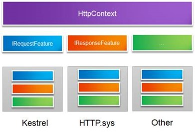 

计算机领域有一句非常经典的话：“**任何问题都可以通过添加一个抽象层的方式来解决，如果解决不了，那就再加一层**”。同一个`HttpContext`类型与不同服务器类型之间的适配问题也可可以通过添加一个抽象层来解决，我们定义在该层的对象称为`Feature`。如上图所示，我们可以定义一系列的`Feature`接口来为`HttpContext`提供上下文信息，其中最重要的就是提供请求的`IRequestFeature`和完成响应的`IResponseFeature`接口。那么具体的服务器只需要实现这些Feature接口就可以了。

 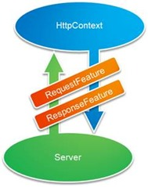 

我们接着从代码层面来看看具体的实现。如下面的代码片段所示，我们定义了一个`IFeatureCollection`接口来表示存放Feature对象的集合。从定义可以看出这是一个以Type和Object作为Key和Value的字典，**Key代表注册Feature所采用的类型，而Value自然就代表Feature对象本身**，话句话说我们提供的Feature对象最终是以对应Feature类型（一般为接口类型）进行注册的。为了编程上便利，我们定义了两个扩展方法`Set<T>`和`Get<T>`来设置和获取Feature对象。

```c#
//IceDog.NetCoreMini\IceDog.NetCoreMini.Core\Http\Features\IFeatureCollection.cs
using System;
using System.Collections.Generic;

namespace IceDog.NetCoreMini.Core.Http.Features
{
    /// <summary>
    /// 特性集合
    /// </summary>
    public interface IFeatureCollection : IDictionary<Type, object>
    {
        /// <summary>
        /// 获取特性
        /// </summary>
        /// <typeparam name="TFeature">特性类型</typeparam>
        /// <returns></returns>
        TFeature Get<TFeature>();
        /// <summary>
        /// 设置特性
        /// </summary>
        /// <typeparam name="TFeature">特性类型</typeparam>
        /// <param name="instance"></param>
        void Set<TFeature>(TFeature instance);
    }
}
```

```c#
//IceDog.NetCoreMini\IceDog.NetCoreMini.Core\Http\Features\FeatureCollection.cs
using System;
using System.Collections.Generic;

namespace IceDog.NetCoreMini.Core.Http.Features
{
    /// <summary>
    /// 特性集合
    /// </summary>
    public class FeatureCollection : Dictionary<Type, object>, IFeatureCollection
    {
        /// <summary>
        /// 获取特性
        /// </summary>
        /// <typeparam name="TFeature">特性类型</typeparam>
        /// <returns></returns>
        public TFeature Get<TFeature>()
        {
            return this.TryGetValue(typeof(TFeature), out var value) ? (TFeature)value : default(TFeature);
        }
        /// <summary>
        /// 设置特性
        /// </summary>
        /// <typeparam name="TFeature">特性类型</typeparam>
        /// <param name="instance"></param>
        public void Set<TFeature>(TFeature instance)
        {
            this[typeof(TFeature)] = instance;
        }
    }
}

```

如下所示的用来提供请求和响应`IHttpRequestFeature`和`IHttpResponseFeature`接口的定义，可以看出它们具有与`HttpRequest`和`HttpResponse`完全一致的成员定义。

```c#
//IceDog.NetCoreMini\IceDog.NetCoreMini.Core\Http\Features\IHttpRequestFeature.cs
using System;
using System.Collections.Specialized;
using System.IO;

namespace IceDog.NetCoreMini.Core.Http.Features
{
    /// <summary>
    /// http请求特性
    /// </summary>
    interface IHttpRequestFeature
    {
        /// <summary>
        /// 请求url
        /// </summary>
        Uri Url { get; }
        /// <summary>
        /// 请求头
        /// </summary>
        NameValueCollection Headers { get; }
        /// <summary>
        /// 请求体
        /// </summary>
        Stream Body { get; }
    }
}
```

```c#
//IceDog.NetCoreMini\IceDog.NetCoreMini.Core\Http\Features\IHttpResponseFeature.cs
using System.Collections.Specialized;
using System.IO;

namespace IceDog.NetCoreMini.Core.Http.Features
{
    /// <summary>
    /// 响应特性
    /// </summary>
    interface IHttpResponseFeature
    {
        /// <summary>
        /// 响应状态码
        /// </summary>
        int StatusCode { get; set; }
        /// <summary>
        /// 响应头
        /// </summary>
        NameValueCollection Headers { get; }
        /// <summary>
        /// 响应体
        /// </summary>
        Stream Body { get; }
    }
}

```

接下来我们来看看`HttpContext`的具体实现。ASP.NET Core Mini的`HttpContext`只包含`Request`和`Response`两个属性成员，对应的类型分别为`HttpRequest`和`HttpResponse`，如下所示的就是这两个类型的具体实现。我们可以看出`HttpRequest`和`HttpResponse`都是通过一个`IFeatureCollection`对象构建而成的，它们对应的属性成员均有分别由包含在这个Feature集合中的`IHttpRequestFeature`和`IHttpResponseFeature`对象来提供的。

```c#
//IceDog.NetCoreMini\IceDog.NetCoreMini.Core\Http\HttpRequest.cs
using IceDog.NetCoreMini.Core.Http.Features;
using System;
using System.Collections.Specialized;
using System.IO;

namespace IceDog.NetCoreMini.Core.Http
{
    /// <summary>
    /// http 请求
    /// </summary>
    public class HttpRequest
    {
        /// <summary>
        /// 自定义构造函数
        /// </summary>
        /// <param name="features"></param>
        public HttpRequest(IFeatureCollection features) => _feature = features.Get<IHttpRequestFeature>();

        /// <summary>
        /// http请求特性
        /// </summary>
        private readonly IHttpRequestFeature _feature;
        /// <summary>
        /// 请求的url
        /// </summary>
        public Uri Url => _feature.Url;
        /// <summary>
        /// 请求头
        /// </summary>
        public NameValueCollection Headers => _feature.Headers;
        /// <summary>
        /// 请求体
        /// </summary>
        public Stream Body => _feature.Body;
    }
}

```

```c#
//IceDog.NetCoreMini\IceDog.NetCoreMini.Core\Http\HttpResponse.cs
using IceDog.NetCoreMini.Core.Http.Features;
using System.Collections.Specialized;
using System.IO;

namespace IceDog.NetCoreMini.Core.Http
{
    /// <summary>
    /// http 响应
    /// </summary>
    public class HttpResponse
    {
        /// <summary>
        /// 自定义构造函数
        /// </summary>
        /// <param name="features"></param>
        public HttpResponse(IFeatureCollection features) => _feature = features.Get<IHttpResponseFeature>();
        /// <summary>
        /// http响应特性
        /// </summary>
        private readonly IHttpResponseFeature _feature;
        /// <summary>
        /// 响应头
        /// </summary>
        public NameValueCollection Headers => _feature.Headers;
        /// <summary>
        /// 响应流
        /// </summary>
        public Stream Body => _feature.Body;
        /// <summary>
        /// 响应状态码
        /// </summary>
        public int StatusCode { get => _feature.StatusCode; set => _feature.StatusCode = value; }
    }
}
```

`HttpContext`的实现就更加简单了。如下面的代码片段所示，我们在创建一个`HttpContext`对象是同样会提供一个`IFeatureCollection`对象，我们利用该对象创建对应的`HttpRequest`和`HttpResponse`对象，并作为对应的属性值。

```c#
//IceDog.NetCoreMini\IceDog.NetCoreMini.Core\Http\HttpContext.cs
using IceDog.NetCoreMini.Core.Http.Features;

namespace IceDog.NetCoreMini.Core.Http
{
    /// <summary>
    /// http 上下文
    /// </summary>
    public class HttpContext
    {
        /// <summary>
        /// 构造函数
        /// </summary>
        /// <param name="features"></param>
        public HttpContext(IFeatureCollection features)
        {
            Request = new HttpRequest(features);
            Response = new HttpResponse(features);
        }

        /// <summary>
        /// 请求对象
        /// </summary>
        public HttpRequest Request { get; }
        /// <summary>
        /// 响应对象
        /// </summary>
        public HttpResponse Response { get; }
        
    }
}

```

### 10. HttpListenerServer

在对服务器和它与HttpContext的适配原理具有清晰的认识之后，我们来尝试着自己定义一个服务器。在前面的Hello World实例中，我们利用`WebHostBuilder`的扩展方法`UseHttpListener`注册了一个HttpListenerServer，我们现在就来看看这个采用`HttpListener`作为监听器的服务器类型是如何实现的。

由于所有的服务器都需要自动自己的`Feature`实现来为`HttpContext`提供对应的上下文信息，所以我们得先来为`HttpListenerServer`定义相应的接口。对`HttpListener`稍微了解的朋友应该知道它在接收到请求之后同行会创建一个自己的上下文对象，对应的类型为`HttpListenerContext`。如果采用`HttpListenerServer`作为应用的服务器，意味着`HttpContext`承载的上下文信息最初来源于这个`HttpListenerContext`，所以`Feature`的目的旨在解决**这两个上下文之间的适配问题**。

 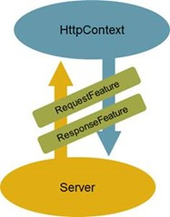 

如下所示的`HttpListenerFeature`就是我们为`HttpListenerServer`定义的`Feature`。`HttpListenerFeature`同时实现了`IHttpRequestFeature`和`IHttpResponseFeature`，实现的6个属性成员最初都来源于创建该`Feature`对象提供的`HttpListenerContext`对象。

```c#
//IceDog.NetCoreMini\IceDog.NetCoreMini.Core\Http\Features\HttpListenerFeature.cs
using System;
using System.Collections.Specialized;
using System.IO;
using System.Net;

namespace IceDog.NetCoreMini.Core.Http.Features
{
    /// <summary>
    /// http监听器特性
    /// </summary>
    public class HttpListenerFeature : IHttpRequestFeature, IHttpResponseFeature
    {
        /// <summary>
        /// http监听器上下文
        /// </summary>
        private readonly HttpListenerContext _context;
        /// <summary>
        /// 构造函数
        /// </summary>
        /// <param name="context"></param>
        public HttpListenerFeature(HttpListenerContext context) => _context = context;

        #region IHttpRequestFeature
        /// <summary>
        /// 请求url
        /// </summary>
        Uri IHttpRequestFeature.Url => _context.Request.Url;
        /// <summary>
        /// 请求头
        /// </s请求头ummary>
        NameValueCollection IHttpRequestFeature.Headers => _context.Request.Headers;
        /// <summary>
        /// 请求体
        /// </summary>
        Stream IHttpRequestFeature.Body => _context.Request.InputStream;
        #endregion

        #region IHttpResponseFeature

        /// <summary>
        /// 响应头
        /// </summary>
        NameValueCollection IHttpResponseFeature.Headers => _context.Response.Headers;
        /// <summary>
        /// 响应体
        /// </summary>
        Stream IHttpResponseFeature.Body => _context.Response.OutputStream;
        /// <summary>
        /// 响应状态码
        /// </summary>
        int IHttpResponseFeature.StatusCode { get => _context.Response.StatusCode; set => _context.Response.StatusCode = value; }
        #endregion
    }
}
```

如下所示的是`HttpListenerServer`的最终定义。我们在构造一个`HttpListenerServer`对象的时候可以提供一组监听地址，如果没有提供，会采用`localhost:5000` 作为默认的监听地址。在实现的`StartAsync`方法中，我们启动了在构造函数中创建的`HttpListenerServer`对象，并在一个循环中通过调用其`GetContextAsync`方法实现了针对请求的监听和接收。

```c#
//IceDog.NetCoreMini\IceDog.NetCoreMini.Core\Http\HttpListenerServer.cs
using IceDog.NetCoreMini.Core.Hosting.Server;
using IceDog.NetCoreMini.Core.Http.Features;
using System;
using System.Linq;
using System.Net;
using System.Threading.Tasks;

namespace IceDog.NetCoreMini.Core.Http
{
    /// <summary>
    /// http监听服务
    /// </summary>
    public class HttpListenerServer : IServer
    {
        /// <summary>
        /// http监听器
        /// </summary>
        private readonly HttpListener _httpListener;
        /// <summary>
        /// 监听的url列表
        /// </summary>
        private readonly string[] _urls;
        /// <summary>
        /// 自定义构造函数
        /// </summary>
        /// <param name="urls"></param>
        public HttpListenerServer(params string[] urls)
        {
            _httpListener = new HttpListener();
            var port = new Random().Next(3000, 10000);
            _urls = urls.Any() ? urls : new string[] { $"http://localhost:{port}/" };
        }
        /// <summary>
        /// 异步启动任务
        /// </summary>
        /// <param name="handler">http处理程序</param>
        /// <returns></returns>
        public async Task StartAsync(RequestDelegate handler)
        {
            //添加监听url列表
            Array.ForEach(_urls, url => _httpListener.Prefixes.Add(url));
            _httpListener.Start();

            while (true)
            {
                //获取监听器上下文
                var listenerContext = await _httpListener.GetContextAsync();
                var feature = new HttpListenerFeature(listenerContext);
                var features = new FeatureCollection();
                features.Set<IHttpRequestFeature>(feature);
                features.Set<IHttpResponseFeature>(feature);
                var httpContext = new HttpContext(features);
                await handler(httpContext);
                listenerContext.Response.Close();
            }
        }
    }
}
```

当`HttpListener`监听到抵达的请求后，我们会得到一个`HttpListenerContext`对象，此时我们只需要据此创建一个`HttpListenerFeature`对象并它分别以`IHttpRequestFeature`和`IHttpResponseFeature`接口类型注册到创建`FeatureCollection`集合上。我们最终利用这个`FeatureCollection`对象创建出代表上下文的`HttpContext`，然后将它作为参数调用由所有中间件共同构建的`RequestDelegate`对象即可。

### 11.第六个对象：WebHost

到目前为止我们已经知道了由一个服务器和多个中间件构成的管道是如何完整针对请求的监听、接收、处理和最终响应的，接下来来讨论这样的管道是如何被构建出来的。管道是在作为应用宿主的`WebHost`对象启动的时候被构建出来的，在ASP.NET Core Mini中，我们将表示应用宿主的`IWebHost`接口简写成如下的形式：只包含一个StartAsync方法用来启动应用程序。

```c#
//IceDog.NetCoreMini\IceDog.NetCoreMini.Core\Hosting\IWebHost.cs
using System.Threading.Tasks;

namespace IceDog.NetCoreMini.Core.Hosting
{
    /// <summary>
    /// web宿主接口
    /// </summary>
    public interface IWebHost
    {
        /// <summary>
        /// 异步启动任务
        /// </summary>
        /// <returns></returns>
        Task StartAsync();
    }
}

```

由于由`WebHost`构建的管道由`Server`和`HttpHandler`构成，我们在默认实现的`WebHost`类型中，我们直接提供者两个对象。在实现的`StartAsync`方法中，我么只需要将后者作为参数调用前者的`StartAsync`方法将服务器启动就可以了。

```c#
//IceDog.NetCoreMini\IceDog.NetCoreMini.Core\WebHost.cs
using IceDog.NetCoreMini.Core.Hosting;
using IceDog.NetCoreMini.Core.Hosting.Server;
using IceDog.NetCoreMini.Core.Http;
using System.Threading.Tasks;

namespace IceDog.NetCoreMini.Core
{
    /// <summary>
    /// web宿主
    /// </summary>
    public class WebHost : IWebHost
    {
        /// <summary>
        /// 构造函数
        /// </summary>
        /// <param name="server">服务器</param>
        /// <param name="handler">处理程序</param>
        public WebHost(IServer server, RequestDelegate handler)
        {
            _server = server;
            _handler = handler;
        }

        /// <summary>
        /// 服务器
        /// </summary>
        private readonly IServer _server;
        /// <summary>
        /// 处理程序
        /// </summary>
        private readonly RequestDelegate _handler;

        /// <summary>
        /// 异步启动任务
        /// </summary>
        /// <returns></returns>
        public Task StartAsync() => _server.StartAsync(_handler);
    }
}
```

### 12. 第七个对象：WebHostBuilder

作为最后一个着重介绍的核心对象，`WebHostBuilder`的使命非常明确：**就是创建作为应用宿主的`WebHost`**。由于在创建WebHost的时候需要提供注册的服务器和由所有注册中间件构建而成的`RequestDelegate`，所以在对应接口IWebHostBuilder中，我们为它定义了三个核心方法。

```c#
//IceDog.NetCoreMini\IceDog.NetCoreMini.Core\Hosting\IWebHostBuilder.cs
using IceDog.NetCoreMini.Core.Builder;
using IceDog.NetCoreMini.Core.Hosting.Server;
using System;

namespace IceDog.NetCoreMini.Core.Hosting
{
    /// <summary>
    /// web宿主构建器
    /// </summary>
    public interface IWebHostBuilder
    {
        /// <summary>
        /// 使用服务
        /// </summary>
        /// <param name="server"></param>
        /// <returns></returns>
        IWebHostBuilder UseServer(IServer server);
        /// <summary>
        /// 配置构建器
        /// </summary>
        /// <param name="configure"></param>
        /// <returns></returns>
        IWebHostBuilder Configure(Action<IApplicationBuilder> configure);
        /// <summary>
        /// 构建宿主
        /// </summary>
        /// <returns></returns>
        IWebHost Build();
        /// <summary>
        /// 使用的http监听器
        /// </summary>
        /// <param name="urls"></param>
        /// <returns></returns>
        IWebHostBuilder UseHttpListener(params string[] urls);
    }
}
```

除了用来创建`WebHost`的`Build`方法之外，我们提供了用来注册服务器的UseServer方法和用来注册中间件的`Configure`方法。`Configure`方法提供了一个类型为`Action<IApplicationBuilder>`的参数，意味着我们针对中间件的注册是利用上面介绍的`IApplicationBuilder`对象来完成的。

如下所示的`WebHostBuilder`是针对`IWebHostBuilder`接口的默认实现，它具有两个字段分别用来保存注册的中间件和调用Configure方法提供的`Action<IApplicationBuilder>`对象。当`Build`方法被调用之后，我们创建一个`ApplicationBuilder`对象，并将它作为参数调用这些`Action<IApplicationBuilder>`委托，进而将所有中间件全部注册到这个`ApplicationBuilder`对象上。我们最终调用它的`Build`方法得到由所有中间件共同构建的`RequestDelegate`对象，并利用它和注册的服务器构建作为应用宿主的`WebHost`对象。

```c#
//IceDog.NetCoreMini\IceDog.NetCoreMini.Core\Hosting\WebHostBuilder.cs
using IceDog.NetCoreMini.Core.Builder;
using IceDog.NetCoreMini.Core.Hosting.Server;
using IceDog.NetCoreMini.Core.Http;
using System;
using System.Collections.Generic;

namespace IceDog.NetCoreMini.Core.Hosting
{
    /// <summary>
    /// web宿主构建器
    /// </summary>
    public class WebHostBuilder : IWebHostBuilder
    {
        /// <summary>
        /// 服务
        /// </summary>
        private IServer _server;
        /// <summary>
        /// 配置构建器列表
        /// </summary>
        private readonly List<Action<IApplicationBuilder>> _configures = new List<Action<IApplicationBuilder>>();
        /// <summary>
        /// 配置构建器
        /// </summary>
        /// <param name="configure"></param>
        /// <returns></returns>
        public IWebHostBuilder Configure(Action<IApplicationBuilder> configure)
        {
            _configures.Add(configure);
            return this;
        }
        /// <summary>
        /// 使用服务
        /// </summary>
        /// <param name="server">服务</param>
        /// <returns></returns>
        public IWebHostBuilder UseServer(IServer server)
        {
            _server = server;
            return this;
        }
        /// <summary>
        /// 构建宿主
        /// </summary>
        /// <returns></returns>
        public IWebHost Build()
        {
            var builder = new ApplicationBuilder();
            foreach (var configure in _configures)
            {
                configure(builder);
            }
            return new WebHost(_server, builder.Build());
        }
        /// <summary>
        /// 使用的http监听器
        /// </summary>
        /// <param name="urls">监听urls</param>
        /// <returns></returns>
        public IWebHostBuilder UseHttpListener(params string[] urls)
        {
            return this.UseServer(new HttpListenerServer(urls));
        }
    }
}
```

### 13. 回顾一下Hello World 2

到目前为止，我们已经将ASP.NET Core Mini涉及的七个核心对象介绍完了，然后我们再来回顾一下建立在这个模拟框架上的Hello World程序。

```c#
public class Program
{
    public static async Task Main()
    {
        await new WebHostBuilder()
            .UseHttpListener()
            .Configure(app => app
                .Use(FooMiddleware)
                .Use(BarMiddleware)
                .Use(BazMiddleware))
            .Build()
            .StartAsync();
    }

    public static RequestDelegate FooMiddleware(RequestDelegate next)
    => async context => {
        await context.Response.WriteAsync("Foo=>");
        await next(context);
    };

    public static RequestDelegate BarMiddleware(RequestDelegate next)
    => async context => {
            await context.Response.WriteAsync("Bar=>");

            await next(context);
        };

    public static RequestDelegate BazMiddleware(RequestDelegate next)
    => context => context.Response.WriteAsync("Baz");
}
```

首选我们调用`WebHostBuilder`的扩展方法`UseHttpListener`采用如下的方式完成了针对`HttpListenerServer`的注册。由于中间件体现为一个`Func<RequestDelegate, RequestDelegate>`对象，我们自然可以采用与之具有相同声明的方法（`FooMiddleware`、`BarMiddleware`和`BazMiddleware`）来定义对应的中间件。中间件调用`HttpResponse`的`WriteAsync`以如下的方式将指定的字符串写入响应主体的输出流。

```c#
//IceDog.NetCoreMini\IceDog.NetCoreMini.Core\Http\HttpResponseExtensions.cs
using IceDog.NetCoreMini.Core.Http;
using System.Text;
using System.Threading.Tasks;

namespace IceDog.NetCoreMini.Core.Extensions
{
    /// <summary>
    /// HttpResponse扩展方法 
    /// </summary>
    public static partial class HttpResponseExtensions
    {
        /// <summary>
        /// HttpResponse 异步写入
        /// </summary>
        /// <param name="response">响应</param>
        /// <param name="contents">内容</param>
        /// <returns></returns>
        public static Task WriteAsync(this HttpResponse response, string contents)
        {
            var buffer = Encoding.UTF8.GetBytes(contents);
            return response.Body.WriteAsync(buffer: buffer, offset: 0, count: buffer.Length);
        }
    }
}
```

## 打个广告：《ASP.NET Core框架揭秘》

ASP.NET Core Mini模拟了真实ASP.NET Core框架最核心的部分，即由服务器和中间件构成的请求处理管道。真正的ASP.NET Core框架自然要复杂得多得多，那么我们究竟遗漏了什么呢？

 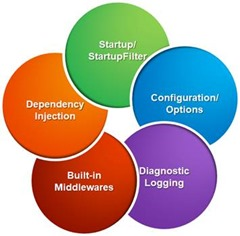 

如上所示的5个部分是ASP.NET Core Mini没有涉及的，其中包括依赖注入、以Startup和StartupFilter的中间件注册方式、针对多种数据源的配置系统、诊断日志系统和一系列预定义的中间件，上述的每个方面都涉及到一个庞大的主题，我们将ASP.NET Core涉及到的方方面都写在我将要出版的《ASP.NET Core框架揭秘》中，如果你想全方面了解一个真实的ASP.NET Core框架，敬请期待新书出版。

[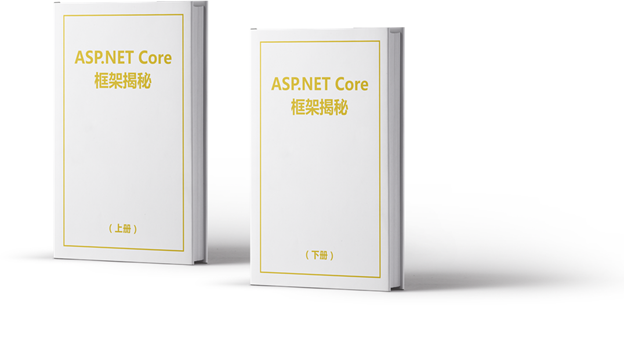](https://img2018.cnblogs.com/blog/19327/201901/19327-20190128121634632-245404936.png)